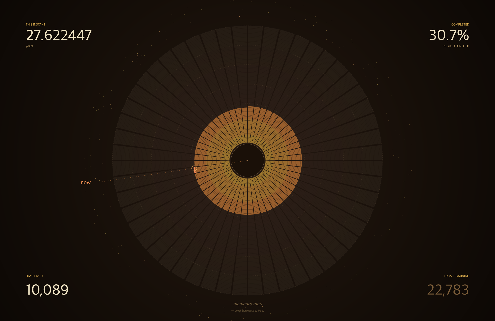

# Life Wallpaper

> 把你的一生，变成桌面壁纸。每分钟刷新"此刻"的位置。
> Turn your life into a living desktop wallpaper. Updates every minute.

每一圈是一年，每一瓣是一周。点亮的部分是你已经度过的时间，暗部是尚未展开的未来。

*Each ring is a year. Each petal, a week. The lit arc is what you've lived; the rest is still to unfold.*



---

## 快速开始 / Quick Start

### 1. 前置条件 / Prerequisites

- **Node.js ≥ 18** — https://nodejs.org
- macOS 11+ 或 Windows 10/11 / macOS 11+ or Windows 10/11

### 2. 安装 / Install

```bash
git clone https://github.com/<YOUR_USER>/life-wallpaper.git
cd life-wallpaper
npm install
```

### 3. 运行 / Run

```bash
npm start
```

首次运行会弹出原生对话框让你输入生日、预期寿命、语言。配置保存在 `~/.life-wallpaper/config.json`（Windows: `%USERPROFILE%\.life-wallpaper\config.json`）。

*On first run, a native dialog asks for your birthday, lifespan, and language. Config is saved to `~/.life-wallpaper/config.json`.*

程序会把壁纸设为 life calendar 并每 60 秒刷新"此刻"位置。按 `Ctrl-C` 停止。

### 4. 开机自启（可选）/ Run on login (optional)

**macOS**
```bash
bash scripts/install-autostart-mac.sh
# 卸载 / uninstall
bash scripts/install-autostart-mac.sh --uninstall
```

**Windows（在 PowerShell 中）**
```powershell
powershell -ExecutionPolicy Bypass -File scripts\install-autostart-win.ps1
# uninstall
powershell -ExecutionPolicy Bypass -File scripts\install-autostart-win.ps1 -Uninstall
```

---

## 命令 / Commands

| 命令 | 作用 |
| --- | --- |
| `npm start` | 启动并持续刷新（后台循环）|
| `npm run setup` | 重新填写生日/寿命/语言 |
| `npm run once` | 只渲染并设置一次壁纸后退出 |

---

## 配置 / Configuration

`~/.life-wallpaper/config.json`：

```json
{
  "birthday": "1998-09-07",
  "lifespan": 80,
  "lang": "zh",
  "refreshSeconds": 60,
  "width": 2560,
  "height": 1664,
  "events": [
    { "age": 18, "label": "大学 / college" },
    { "age": 22, "label": "工作 / first job" }
  ]
}
```

- `width` / `height` 不填时自动探测主显示器原生分辨率。
- `events` 在对应年份的圈上点一个小点（已过的暖金色，未来的灰色）。
- 配置改动下一次刷新即生效，无需重启。

---

## 工作原理 / How it works

渲染用 `@napi-rs/canvas`（纯预编译二进制，无需 cairo），把一张 PNG 写到 `~/.life-wallpaper/`，然后：

- **macOS** — 调 `NSWorkspace.setDesktopImageURL` 通过 JXA 设置所有 desktops（Sonoma+ 原生 API）
- **Windows** — `SystemParametersInfo(SPI_SETDESKWALLPAPER)` via P/Invoke

macOS 有壁纸缓存，程序用两张文件交替写入来绕开缓存。

---

## 卸载 / Uninstall

```bash
# 停止自启（如装了）
bash scripts/install-autostart-mac.sh --uninstall   # mac
# 或 win: powershell ... -Uninstall

rm -rf ~/.life-wallpaper   # mac / linux
# Remove-Item -Recurse $env:USERPROFILE\.life-wallpaper   # win
```

再到系统设置手动换回你喜欢的壁纸。

---

## License

MIT
